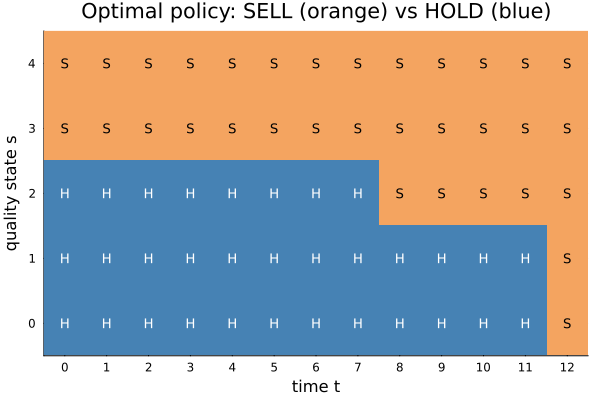
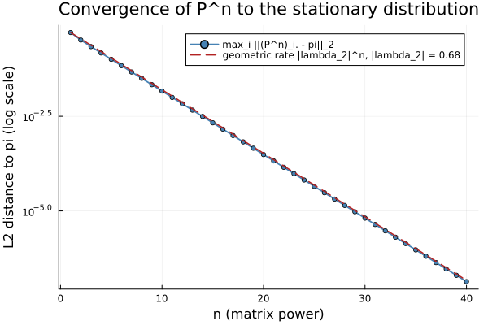

# Selling a Decaying Asset: A Markov Stopping Rule

Finite-horizon Markov-modulated optimal stopping in Julia.

## Result

Monotone SELL/HOLD threshold. From a random start it earns 71.1 vs 60.0 for immediate sale,
an 18% gain. The chain forgets its start at rate |lambda_2| = 0.680.




## Run it

First instantiate the pinned environment:

```
julia --project=.
julia> import Pkg; Pkg.instantiate()
```

Then run either notebook (both produce the same results and figures):

- **IJulia / Jupyter:** open `notebooks/markov_asset.ipynb` and select the `Julia (repo) 1.12`
  kernel (registered via IJulia's `installkernel("Julia (repo)", "--project=@.")`, so it binds to
  this repo's environment). Run all cells.
- **Pluto:** `import Pkg; Pkg.add("Pluto"); using Pluto; Pluto.run()`, then open
  `notebooks/markov_asset_pluto.jl`. Its first cell activates the repo environment, so Pluto shares
  the same package versions instead of managing its own.

## Tests

```
julia --project=. test/runtests.jl
```

`test/runtests.jl` checks the Markov environment (stationarity, `|lambda_2|`, the stationary
distribution) and the stopping engine (terminal condition, monotone threshold policy, and the
reference value function).

### Linting

Install the dev tools once into your default Julia environment (kept out of the pinned project):

```
julia -e 'using Pkg; Pkg.add(["JET", "JuliaFormatter"])'
```

Then run the format check and static analysis in one command:

```
julia --project=. scripts/lint.jl
```

This reports formatting suggestions (without modifying files) and runs JET on `test/runtests.jl`.

## Deliverables

- Slides: `docs/slides.pdf`
- One-pager: `docs/one_pager.pdf`
- Video walkthrough: <link>

## Author

Adam Nuccio
